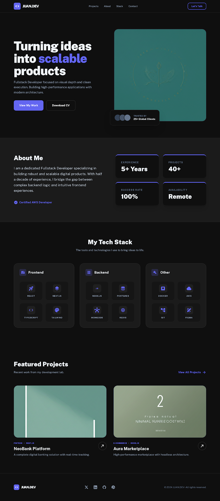

# 🚀 Portfolio Personal

**Desarrollado con Nuxt 4, TypeScript y Tailwind CSS v4**

[](https://personal-portfolio-3ke.pages.dev/)
[](https://my-dev-space.netlify.app/)
[](https://jhonttt.github.io/personal-portfolio/)
[](http://vps22472.cubepath.net/)
[](https://portfolio-frontend-aesklu-5c501a-45-90-237-109.traefik.me/)

---

## 🛠️ Stack Tecnológico

### 🌟 Framework & Core


### 🎨 Estilos & UI


### 📦 Estado & Herramientas


### 🔧 Nuxt Modules & DevOps


---

## 🚀 Arranque Rápido

```bash
# 1️⃣ Clona el repositorio
git clone https://github.com/Jhonttt/personal-portfolio.git
cd personal-portfolio

# 2️⃣ Instala las dependencias
npm install

# 3️⃣ Configura las variables de entorno
cp .env.example .env

# 4️⃣ Inicia el servidor de desarrollo
npm run dev

# 5️⃣ Build para producción
npm run generate
# o
npm run build
```

---

## ✨ Características

- 🎯 **Diseño responsive** con mobile-first approach
- ⚡ **Optimización extrema** con Nuxt 4 y Tailwind CSS v4
- 🔍 **SEO completo** con sitemap automático y metadatos
- 📱 **Accesibilidad WCAG** implementada
- 🌍 **Multidespliegue** en 5 plataformas simultáneas
- 🔄 **CI/CD fully automated** con GitHub Actions
- 🎨 **UI moderna** con animaciones suaves
- 📦 **Arquitectura modular** y mantenible

---

## 📋 Scripts disponibles

| Comando                | Descripción                                                           |
| ---------------------- | --------------------------------------------------------------------- |
| `npm run dev`          | 🖥️ Servidor de desarrollo en http://localhost:3000                    |
| `npm run generate`     | 📦 Build estático para producción (GitHub Pages, Cloudflare, Netlify) |
| `npm run build`        | 🏗️ Build con SSR (VPS, DokPloy)                                       |
| `npm run preview`      | 👁️ Preview del build en local                                         |
| `npm run lint`         | ✅ Ejecutar ESLint                                                    |
| `npm run typecheck`    | 🔍 Verificar tipos con TypeScript (vue-tsc)                           |
| `npm run lint:fix`     | 🔧 Corregir errores de ESLint automáticamente                         |
| `npm run format`       | 🎨 Formatear código con Prettier                                      |
| `npm run format:check` | 🔍 Verificar formato sin modificar                                    |

---

## 🗂️ Estructura del proyecto

```bash
personal-portfolio/
├── .github/                    # GitHub Actions & config
│   └── workflows/
│       ├── deploy.yml         # 🖥️ Deploy a VPS
│       └── deploy-pages.yml   # 📦 Deploy a GitHub Pages
├── app/
│   ├── assets/css/main.css    # 🎨 Tailwind + estilos globales
│   ├── components/            # 🧩 Componentes Vue
│   │   ├── base/              # 🔧 Primitivos reutilizables
│   │   ├── layout/            # 📐 Estructura de página
│   │   └── sections/          # 📄 Secciones del portfolio
│   ├── composables/           # 🛠️ Composable functions
│   │   └── usePublicAsset.ts  # 🔗 Resuelve rutas de assets
│   ├── data/                  # 📊 Datos estáticos JSON
│   │   ├── general.json
│   │   ├── navigation.json
│   │   ├── projects.json
│   │   └── skills.json
│   ├── stores/                # 🏪 Estado global (Pinia)
│   │   └── portfolio.ts
│   ├── app.vue                # 🎯 Componente raíz
│   └── error.vue              # ⚠️ Página de error
├── public/                    # 🖼️ Assets estáticos
│   ├── icons/skills.svg       # 🎯 Iconos de tecnologías
│   ├── images/                # 🖼️ Imágenes del portfolio
│   ├── og-image.webp          # 📱 Open Graph
│   ├── robots.txt
│   └── sprite.svg             # 🌐 Iconos sociales
├── .env.example               # ⚙️ Variables de entorno de ejemplo
├── nuxt.config.ts             # ⚙️ Configuración de Nuxt
└── package.json               # 📦 Dependencias y scripts
```

---

## 🏗 Arquitectura

El portfolio sigue una arquitectura de **sitio estático generado** (`nuxt generate`):

- **Datos** centralizados en JSONs bajo `app/data/`, consumidos por `usePortfolioStore`
- **Store** único de solo lectura que expone todos los datos del portfolio
- **Componentes** en tres capas — `base/` (primitivos) → `layout/` (estructura) → `sections/` (contenido)
- **Assets públicos** siempre referenciados via `usePublicAsset()` para compatibilidad entre entornos

---

## 📐 Convenciones

- **Componentes** en PascalCase: `BaseButton.vue`, `HeroSection.vue`
- **Composables** con prefijo `use`: `usePublicAsset.ts`
- **Commits** siguiendo [Conventional Commits](https://www.conventionalcommits.org/): `feat:`, `fix:`, `chore:`, `a11y:`, `design:`
- **Ramas** con prefijo de tipo: `feat/`, `fix/`, `chore/`
- **Estilos** mobile-first con clases de Tailwind

---

## 🔄 CI/CD Automatizado

Cada push a la rama `main` ejecuta este pipeline:

```
git push → main
    │
    ├── ✅ Linting (ESLint + Prettier)
    │
    ├── 🔍 Type Check (TypeScript)
    │
    └── 🚀 Despliegue Multiplataforma
        ├── 📦 GitHub Pages      (via GitHub Actions)
        ├── 🖥️ VPS CubePath      (via SSH + GitHub Actions)
        ├── ☁️ Cloudflare Pages   (via Webhook)
        ├── 🟢 Netlify           (via Webhook)
        └── 🐳 DokPloy CubePath  (via Webhook)
```

_✨ Uso de **Husky + commitlint** para la validación de commits_

---

## 🖼️ Mockup



_Vista previa del diseño del portfolio_
